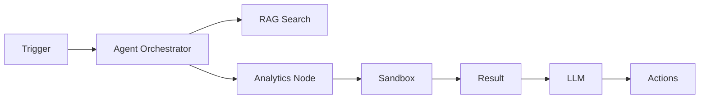
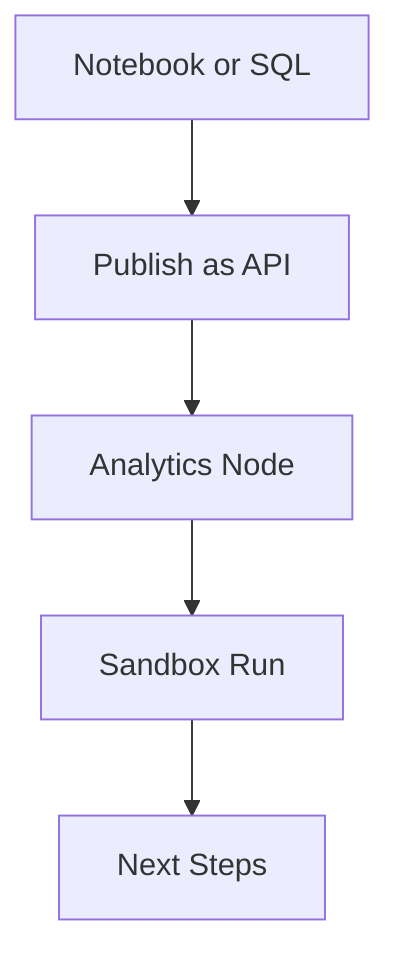
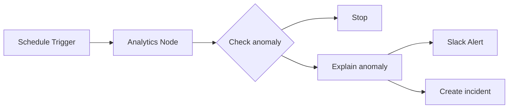

import { AIWorkflowDemo } from '../../../components/ui/aiagentui'

<AIWorkflowDemo />

This page explains what Adeloop AI Agents are, how they work, and how they combine **n8n‑style automation** with **first‑class data analytics**. You can orchestrate triggers, APIs, LLMs, and Adeloop analytics nodes in one canvas so agents can both _reason_ and _calculate_.

---

## Executive summary

Adeloop AI Agents are autonomous or semi‑autonomous workflows that:

- Listen to **events and schedules**
- Call **LLMs, tools and external APIs**
- Run **analytics workloads in Adeloop** (SQL, notebooks, dashboards) through an API
- Execute everything inside an **isolated sandbox** for safety

Conceptually, the platform feels similar to **n8n**: you build a graph of nodes and edges.  
The difference is that Adeloop adds a **built‑in analytics layer** so agents can query, transform and score data before deciding what to do next.



---

## Core building blocks

Adeloop agents are built from a small set of node types:

- **Triggers**
  - Webhooks (HTTP)
  - Schedules (cron‑like)
  - Manual runs from the UI

- **Adeloop Analytics Node**
  - Calls a **published Adeloop API** that was built from a notebook, SQL query, or dashboard.
  - Runs inside a **sandboxed runtime**: no shared state, controlled resources, deterministic inputs.
  - Returns structured outputs (JSON, tables, metrics) that can be consumed by downstream nodes.

- **RAG & Retrieval Nodes**
  - Use your RAG infrastructure (see `architecture/rag`) to ground LLM calls in **company data and docs**.
  - Typical pattern: “retrieve context → call LLM with tools → return answer + citations”.

- **Action Nodes**
  - Side‑effectful operations such as:
    - Sending email/Slack/Teams messages
    - Writing to a database or data warehouse
    - Calling arbitrary REST / GraphQL APIs

- **Control‑Flow Nodes**
  - If/Else branches, switches, loops and retries.
  - Used to fan out based on metrics produced by Adeloop or RAG nodes (e.g. anomaly score, policy flag).

---

## From analytics to agent node

The unique part of Adeloop is that **any analysis you build can become an agent node**:

1. **Explore & analyze in Adeloop**
   - Work in notebooks, SQL, dashboards.
   - Join multiple datasets, build derived tables, and compute metrics.

2. **Publish as an API**
   - Turn a notebook cell, query, or dashboard into a **versioned API endpoint**.
   - Define the **input schema** (parameters) and **output schema** (JSON / table shape).

3. **Use it as a node in an agent**
   - In the agents canvas, add an **“Adeloop Analytics” node**.
   - Point it at your published API, map incoming payload fields to the API parameters.
   - Downstream nodes can branch on returned metrics, rows, and flags.



The sandbox ensures every API call is **isolated per run**, so your automation stays stable and debuggable.

---

## Example: data‑driven alerting agent (n8n‑style)

Imagine an agent that:

1. Runs every hour.
2. Pulls the latest revenue and error‑rate metrics from Adeloop.
3. Asks an LLM to explain anomalies.
4. Posts a summary to Slack and, if severe, opens an incident.

High‑level node graph:



At the Adeloop layer you might have a notebook cell like:

```python
# Simplified example: compute anomaly flags in Adeloop, then publish as API
df = read_dataset("daily_metrics")
df["revenue_delta"] = df["revenue"].pct_change()
df["error_rate_delta"] = df["error_rate"].pct_change()

latest = df.sort_values("date").tail(1)
return {
    "revenue": float(latest["revenue"].iloc[0]),
    "error_rate": float(latest["error_rate"].iloc[0]),
    "is_anomaly": bool(abs(latest["revenue_delta"].iloc[0]) > 0.2)
}
```

Publishing this cell as an API gives you an **`get_kpis()`** endpoint that the agent can call as an analytics node.

---

## Building reliable agents

When designing automations that can **act** on your data:

1. **Start from the analytics**
   - Decide what you want to measure or detect (KPIs, thresholds, anomalies).
   - Build and test it in Adeloop first, and only then expose it as an API node.

2. **Keep nodes focused**
   - One node = one responsibility (fetch metrics, classify, send notification, write to DB).
   - This makes debugging and reuse much easier, similar to n8n flows.

3. **Use the sandbox intentionally**
   - Treat every analytics call as a **pure function**: inputs → outputs, no hidden side‑effects.
   - Log inputs/outputs so you can replay problematic runs.

4. **Guardrails and approvals**
   - For destructive actions (deleting data, updating finance systems), add an explicit
     “approval” or “review” step in the graph.

5. **Observe and iterate**
   - Use logs and the dashboard panel from the live demo to:
     - Inspect run history
     - Track success/failure rates
     - Refine prompts, thresholds, and node composition

This combination of **visual automation**, **analytics APIs**, and **sandboxed execution** is what makes Adeloop agents a good fit for production‑grade, data‑driven workflows.

