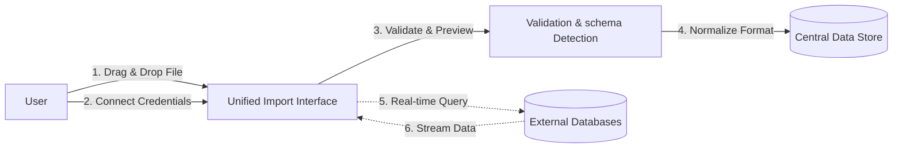

import ToolsIntegration from '../../../components/ui/tools-integration'

<ToolsIntegration />

The Data Ingestion system is the entry point for all data analysis within the platform. It provides a unified, secure, and user-friendly interface for importing local files and connecting to live external databases.

## Architecture Overview

The system abstracts the complexity of different data sources behind a single, consistent interface. Whether uploading a static CSV or connecting to a live PostgreSQL database, the user experience remains seamless.

### Core Components

1.  **Unified Import Interface**: A single modal that handles multiple input methods. Users don't need to navigate to different pages for different data types.
2.  **Schema Detection Engine**: Automatically analyzes incoming data (both files and DB tables) to detect column types, format dates, and identify potential issues before import.
3.  **Secure Credential Manager**: Handles database connection strings with server-side encryption. Credentials are never exposed to the client-side/browser storage.

---

## Supported Data Sources

### 1. File Uploads
Designed for static datasets and ad-hoc analysis.

| Format | Features | Best For |
| :--- | :--- | :--- |
| **CSV** | Fast parsing, auto-delimiter detection | Large, flat datasets |
| **Excel (.xlsx)** | Multi-sheet support, formula value extraction | Financial reports, business data |
| **JSON** | Nested structure flattening | API responses, logs |

**Key Features:**
*   **Drag & Drop**: Intuitive upload zone.
*   **Preview**: Instant look at the first 50 rows before committing.
*   **Version History**: Track changes to datasets over time.

### 2. External Databases
Designed for live, dynamic data access. The platform acts as a secure client, fetching data on demand.

| Database | Features | Best For |
| :--- | :--- | :--- |
| **PostgreSQL** | SSL support, schema browsing | Production application data |
| **MySQL** | TCP connection, optimized fetching | Web application backends |
| **MongoDB** | Collection execution, JSON compatibility | Document stores, audit logs |

**Security Architecture:**
*   **Encryption**: All passwords and connection strings are encrypted at rest using AES-256.
*   **No Persistence**: We do not store the actual data from external DBs unless explicitly imported. We query it in real-time.
*   **Read-Only Safe**: Connections are treated as read-only by default to prevent accidental data modification.

---

## Ingestion Workflow

### File Ingestion Flow
1.  **Upload**: User selects a file.
2.  **Client-Side Parse**: Small files are parsed locally for immediate feedback.
3.  **Server Upload**: Large files are streamed to the secure storage bucket.
4.  **Metadata Extraction**: The system calculates row counts, column types, and data quality metrics.
5.  **Availability**: The dataset becomes immediately available for SQL querying and Python analysis.

### Database Connection Flow
1.  **Connect**: User enters credentials (Host, Port, User, Password).
2.  **Test**: The system attempts a localized "ping" to verify connectivity and permissions.
3.  **Save**: Valid credentials are securely stored.
4.  **Browse**: The user can see a list of available schemas and tables.
5.  **Query**: When a table is selected for analysis, dynamic SQL queries connect to the source to fetch the latest data.

---

## User Experience Features

-   **Unified "Add Data" Modal**: One click to access all ingestion methods.
-   **Smart Type Inference**: Automatically distinctions between numbers, dates, and strings to prevent downstream analysis errors.
-   **Connection Testing**: "Test Connection" button ensures credentials are valid before saving.
-   **Saved Connections**: Reuse database credentials without re-entering them (securely stored).

