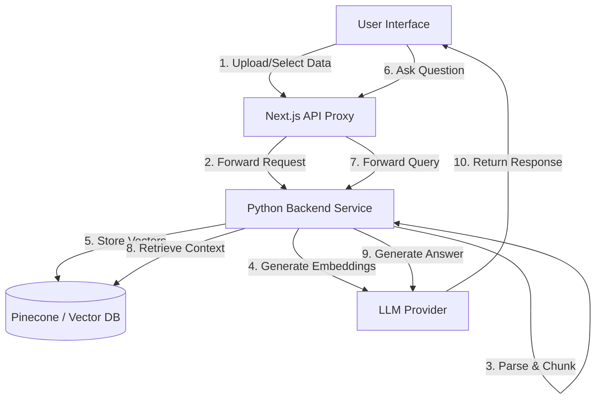

import ToolsIntegration from '../../../components/ui/tools-integration'

<ToolsIntegration />

The RAG (Retrieval-Augmented Generation) system enables users to interact naturally with their data. By embedding datasets and documents into a vector database, the system allows for semantic search and context-aware responses from LLMs.

## Architecture Overview

The system utilizes a hybrid architecture where the frontend handles user interaction and state management, while a dedicated Python backend orchestrates the heavy lifting of document parsing, embedding, and vector retrieval.



### Key Components

1.  **RAG Interface**: The main UI component that manages the document selection sidebar, chat interface, and settings. It monitors the connection status to the backend and handles the state of embedded documents.
2.  **API Proxy Layer**: A set of Next.js API routes that act as a secure gateway. They validate user sessions, fetch dataset metadata from the primary database, and forward authenticated requests to the Python service.
3.  **Python RAG Service**: A dedicated service responsible for:
    -   **Document Parsing**: converting various file formats (PDF, CSV, etc.) into processable text chunks.
    -   **Embedding**: Generating vector representations of text using high-dimensional embedding models.
    -   **Orchestration**: Managing the interaction between the vector database and the LLM.

---

## Data Flow

### 1. Embedding Process
When a user toggles the "Embed" switch for a dataset, the following process is triggered:

1.  **Fetch**: The Next.js proxy retrieves the full dataset content from the application database.
2.  **Transmit**: The data is securely sent to the Python backend.
3.  **Process**: The backend parses the content (using specialized parsers for different file types) and splits it into semantic chunks.
4.  **Vectorize**: Each chunk is converted into a vector embedding.
5.  **Index**: Vectors are upserted into the Pinecone index with metadata (source ID, text content).
6.  **Flag**: The dataset is marked as `embedded` in the primary database to reflect its status in the UI.

### 2. Query Execution
When a user asks a question in the chat interface:

1.  **Vectorize Query**: The user's question is converted into a vector using the same embedding model.
2.  **Semantic Search**: The vector database is queried to find the most relevant text chunks (nearest neighbors) based on cosine similarity.
3.  **Context Assembly**: retrieved chunks are assembled into a context window.
4.  **Generation**: The LLM generates an answer based strictly on the provided context, ensuring grounded responses.

---

## Usage Examples

### Embedding a Dataset
The system operates via a RESTful API. Below is a conceptual example of the payload sent to the backend to initiate embedding:

```json
// POST /api/rag/embed
{
  "dataset_id": "ds_12345",
  "user_id": "user_abc789",
  "name": "sales_report_q1.csv",
  "data": [
    { "product": "Widget A", "sales": 1200 },
    { "product": "Widget B", "sales": 850 }
  ],
  "file_type": "csv"
}
```

### Querying with Context
When querying, the system filters context by the specific dataset IDs relevant to the user's session:

```json
// POST /api/rag/query
{
  "query": "What were the sales for Widget A?",
  "dataset_ids": ["ds_12345"], // Context filter
  "top_k": 5 // Number of chunks to retrieve
}
```

---

## Features

### Smart Context Management
-   **Pinned Datasets**: Users can "pin" specific datasets to keep them permanently in the context window.
-   **Hybrid Search**: Combines keyword search with semantic search for better accuracy (where supported).
-   **Source Citations**: Responses include references to the specific documents and chunks used to generate the answer.

### Security & Isolation
-   **Namespace Isolation**: vectors are stored in isolated namespaces (e.g., per user or tenant) to ensure data privacy.
-   ** ephemeral Processing**: Raw document data is processed in memory on the backend and not permanently stored there; only the vectors and necessary metadata persist in the vector DB.

### Data Strategy & Analysis Patterns

The platform employs a specialized strategy for different data types to ensure optimal analysis accuracy.

#### 1. Unstructured Data (RAG)
**Best for**: PDFs, Word documents, Images (OCR), Policy files, Knowledge bases.
*   **Why**: These documents contain rich semantic context but lack rigid structure.
*   **Mechanism**: We use **RAG** (embedding + vector search) to retrieve relevant "chunks" of text based on the user's query.
*   **Use Case**: Finding specific rules, compliance policies, or historical context (e.g., "What is the reimbursement limit for travel?").

#### 2. Structured Data (SQL & Python)
**Best for**: CSVs, Excel spreadsheets, Databases.
*   **Why**: Vector embeddings often lose the precise row-column relationships needed for quantitative analysis (aggregations, precise filtering, math).
*   **Mechanism**: We use **DuckDB (SQL)** or **Pandas (Python)** for deterministic execution.
*   **Use Case**: Calculating totals, trends, or specific metrics (e.g., "What was the total revenue in Q3?").

#### 3. The "AI Synthesis" Layer
The AI acts as the bridge between these two worlds. It does not "guess" the data values; instead, it:
1.  **Executes Code**: Writes and runs SQL/Python to get *hard facts* from structured data.
2.  **Retrieves Context**: Uses RAG to find *rules/context* from unstructured documents.
3.  **Synthesizes**: Combines the facts with the rules to provide a comprehensive answer.

> **Example Workflow**:
> *   **User**: "Is the Q1 expense report within policy?"
> *   **Step A (Structured)**: AI queries the CSV using Python/SQL -> Result: "Q1 Total Expense: $12,000".
> *   **Step B (Unstructured)**: AI searches the Company Policy PDF using RAG -> Result: "Quarterly expense limit is $10,000".
> *   **Step C (Synthesis)**: AI answers: "No, the Q1 expense ($12,000) exceeds the policy limit of $10,000."

### Supported Data Types
The system is designed to handle multiple input formats:
-   **Structured Data**: CSVs, Excel files (converted to textual representations).
-   **Unstructured Documents**: PDFs, Word documents, Markdown files.
-   **images**: (Future/Beta) Vision-capable embedding for image analysis.
