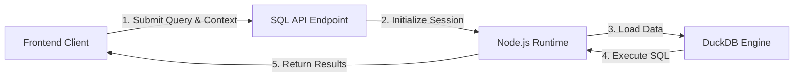
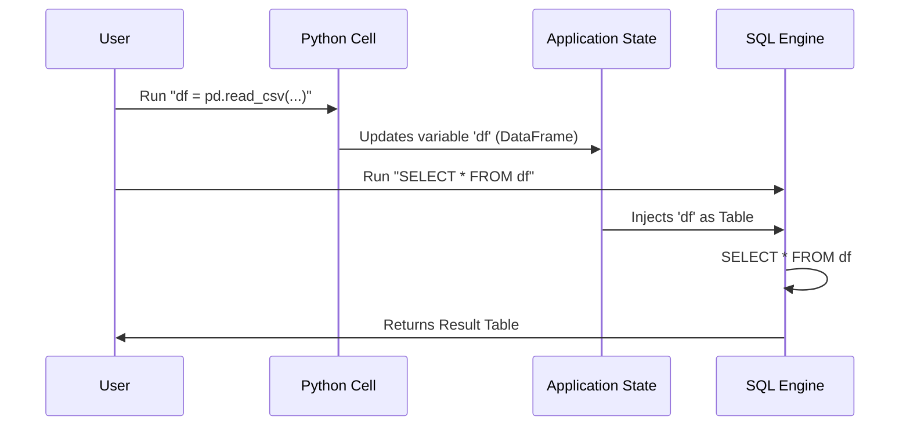

import ToolsIntegration from '../../../components/ui/tools-integration'

<ToolsIntegration />

This guide explains the architecture of the SQL engine within the platform. We utilize **DuckDB** on the backend to provide robust, high-performance SQL execution capable of handling complex analytical queries and seamless interoperability with Python variables.

## Architecture Overview

The platform uses a scalable client-server architecture for SQL execution. This ensures that heavy data processing happens on the server, keeping the client lightweight and responsive.



### Key Components

1.  **Frontend Execution Handler**: Manages user input from the notebook cells, captures the current state (including datasets and variables), and securely transmits them to the backend.
2.  **SQL API Endpoint**: The secure gateway that receives query requests, validates permissions, and orchestrates the execution lifecycle.
3.  **Data Processing Engine**: A dedicated wrapper around the DuckDB instance that handles connection pooling, dynamic table creation, and query optimization.

---

## Python & SQL Interoperability

One of the most powerful features of the platform is the ability to seamlessly share data between Python and SQL cells. This allows for a hybrid workflow where you can use Python for data extraction/cleaning and SQL for analytical querying.

### How It Works

The platform automatically tracks variables created in Python cells. When a SQL cell is executed, these variables are "injected" into the SQL engine as temporary tables.



### Data Flow Example

#### 1. Define Data in Python
First, create a DataFrame or variable in a Python cell. The platform detects this change.

```python
import pandas as pd

# Create a simple DataFrame
sales_data = pd.DataFrame({
    'product': ['Laptop', 'Mouse', 'Monitor'],
    'revenue': [1200, 25, 300],
    'units': [5, 50, 10]
})

# You can also use simple variables
tax_rate = 0.08
```

#### 2. Query in SQL
In a subsequent SQL cell, you can reference `sales_data` as if it were a standard database table.

```sql
-- The dataframe 'sales_data' is automatically available as a table
SELECT 
    product,
    revenue,
    (revenue * units) as total_revenue
FROM sales_data
WHERE revenue > 50
ORDER BY total_revenue DESC;
```

---

## Data Ingestion & Features

### Excel File Support
The platform includes native support for Excel files. You essentially don't need to parse them manually in Python. The SQL engine uses the `spatial` extension to read `.xlsx` files directly.

```sql
-- Behind the scenes, the engine optimizes this loading
SELECT * FROM st_read('quarterly_report.xlsx')
```

### Advanced SQL Capabilities
Because the engine runs on the server, it supports the full breadth of DuckDB's analytical features:

-   **Window Functions**: `RANK()`, `LEAD()`, `LAG()`
-   **Common Table Expressions (CTEs)**: `WITH ... SELECT ...`
-   **Complex Joins**: Efficiently join multiple large datasets.

### Session Persistence
The architecture supports session-based persistence. Tables created via `CREATE TABLE` statements within a session remain available for subsequent queries, enabling multi-step SQL workflows.

```sql
-- Step 1: Create a summary table
CREATE TABLE high_value_items AS 
SELECT * FROM inventory WHERE price > 500;

-- Step 2: Query it later in another cell
SELECT COUNT(*) FROM high_value_items;
```

---

## Performance Notes

-   **Speed**: The server-side engine typically performs **10-100x faster** than client-side alternatives for aggregations.
-   **Scalability**: Capable of handling millions of rows efficiently, limited only by the server's memory allocation.
-   **Security**: All execution happens in a controlled, sandboxed environment.
