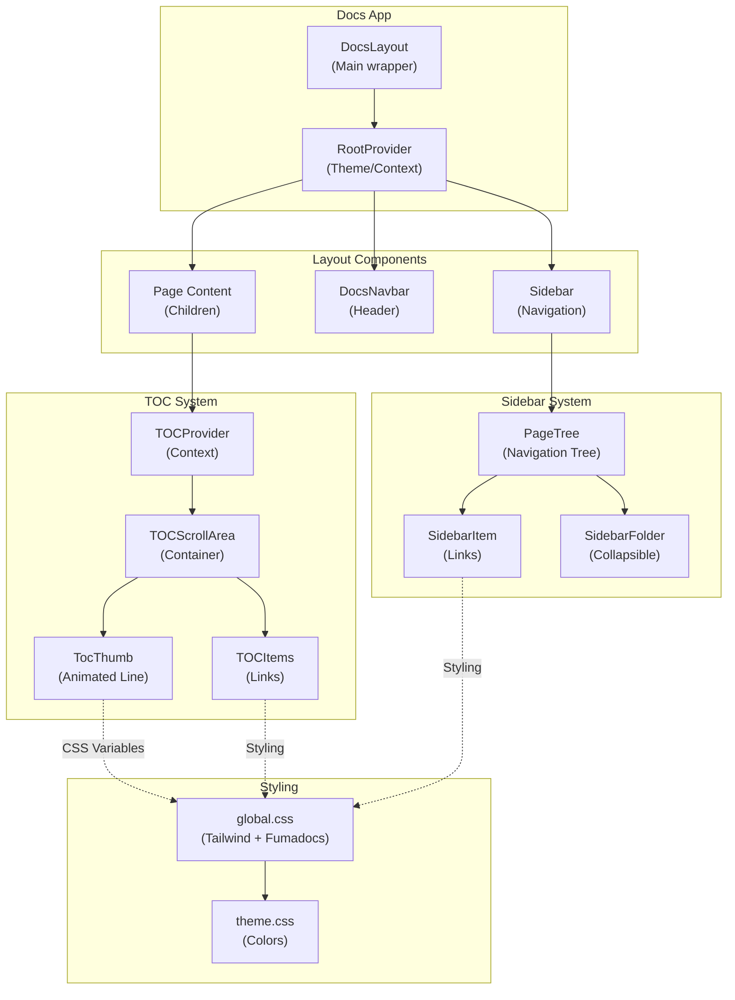

# Adeloop Documentation Repository

A next-generation analytics and business intelligence platform documentation built with **Fumadocs** and **Next.js 15**.

## 📋 Project Overview

**Name**: AdeloopDocs  
**Framework**: Next.js 15 (with Turbopack)  
**Documentation Framework**: Fumadocs v15.8.0  
**Styling**: TailwindCSS v4.1.13  
**UI Components**: Fumadocs UI, Radix UI  
**Animations**: Framer Motion v12.23.25

## 🏗️ Project Structure

```
AdeloopDocs/
├── app/
│   ├── (home)/                 # Home layout wrapper
│   ├── docs/                   # Documentation pages layout
│   ├── layout.tsx              # Root layout with RootProvider
│   ├── layout.config.tsx       # Global layout configuration (baseOptions)
│   ├── global.css              # Global styles & Tailwind imports
│   └── theme.css               # Theme-specific styles
├── components/
│   ├── layout/
│   │   ├── notebook/           # Docs layout components
│   │   │   ├── index.tsx       # DocsLayout wrapper (main component)
│   │   │   ├── sidebar.tsx     # Sidebar with custom styling
│   │   │   ├── client.tsx      # Client-side layout components
│   │   │   └── page/           # Page-specific components
│   │   ├── sidebar/            # Sidebar rendering & structure
│   │   │   ├── base.tsx        # Base sidebar components (SidebarItem, SidebarFolder, etc.)
│   │   │   ├── page-tree.tsx   # Page tree renderer
│   │   │   └── tabs/           # Sidebar tabs functionality
│   │   ├── search-toggle.tsx   # Search UI toggle
│   │   ├── theme-toggle.tsx    # Dark/Light mode toggle
│   │   └── language-toggle.tsx # Language switcher
│   ├── toc/                    # Table of Contents components
│   │   ├── index.tsx           # TOC provider & scroll area (animation logic)
│   │   ├── default.tsx         # Default TOC items with vertical line animation
│   │   └── clerk.tsx           # Clerk authentication TOC variant
│   ├── ui/                     # UI components (buttons, cards, etc.)
│   ├── mdx/                    # MDX-specific components
│   └── mdx.tsx                 # MDX provider
├── content/
│   └── docs/                   # MDX documentation files
│       ├── adeloop/            # Platform documentation
│       └── examples/           # Code examples
├── lib/
│   ├── source.ts              # Content source configuration
│   ├── layout.shared.tsx      # Layout configuration (old)
│   ├── icons.tsx              # Icon library
│   ├── is-active.ts           # Link active state utility
│   ├── metadata.ts            # SEO metadata utilities
│   └── cn.ts                  # Class name merger utility
├── public/                     # Static assets & images
├── fonts/                      # Google fonts (Geist)
├── hooks/                      # Custom React hooks
├── docs/                       # Documentation & architecture notes
├── package.json                # Dependencies
├── tsconfig.json               # TypeScript configuration
├── next.config.mjs             # Next.js configuration
├── postcss.config.mjs          # PostCSS configuration
└── cli.json                    # Fumadocs CLI configuration
```

## 📦 Key Dependencies

| Package | Version | Purpose |
|---------|---------|---------|
| `next` | ^15.5.4 | React framework & server |
| `fumadocs-ui` | ^15.8.0 | Documentation UI components |
| `fumadocs-core` | ^15.8.0 | Core documentation utilities |
| `fumadocs-mdx` | ^12.0.1 | MDX file processing |
| `react` | ^19.1.1 | UI library |
| `tailwindcss` | ^4.1.13 | Styling framework |
| `framer-motion` | ^12.23.25 | Animations |
| `@radix-ui/*` | Latest | Accessible UI primitives |
| `shiki` | ^3.13.0 | Code syntax highlighting |
| `mermaid` | ^11.12.2 | Diagram rendering |

## 🎨 Styling System

- **Color Scheme**: Warm neutral with indigo primary (HSL-based CSS variables)
- **Theme**: Light/Dark mode support via `next-themes`
- **Animation Library**: Tailwind + Framer Motion
- **CSS Architecture**: 
  - Tailwind v4 with `@source` directive
  - CSS custom properties for dynamic theming
  - Fumadocs preset CSS imports

## 🔧 Scripts

```bash
npm run dev          # Start dev server with Turbopack
npm run build        # Build with Turbopack
npm start            # Start production server
npm run lint         # Run ESLint
npm run postinstall  # Generate MDX files
```

## 🐛 TOC Animation Issue Analysis

### Problem
The vertical line animation is **not visible** on the TOC (Table of Contents) sidebar, even though `activeIndicator` is configured in `app/docs/layout.tsx`.

### Root Cause

The issue lies in the **mismatch between fumadocs configuration approach** and how the TOC animation actually works:

#### ❌ Current Configuration (Not Working)
```tsx
// app/docs/layout.tsx
<DocsLayout
  toc={{
    activeIndicator: {
      className: "absolute left-0 w-1 rounded-full bg-indigo-500 z-30 transition-all duration-300 ease-in-out",
    },
  }}
/>
```

**Why it doesn't work:**
1. The `activeIndicator` className only provides **static styling** (width, color, transitions)
2. It's missing the **critical CSS custom properties** that control the animation height and position
3. The fumadocs-ui library needs `--fd-top` and `--fd-height` variables to animate the height

#### ✅ How TOC Animation Actually Works

In `components/toc/index.tsx`, the `TocThumb` component and `Updater` function:

```tsx
// Line 134-135: Sets CSS custom properties
function update(element: HTMLElement, info: TocThumb): void {
  element.style.setProperty('--fd-top', `${info[0]}px`);     // Position from top
  element.style.setProperty('--fd-height', `${info[1]}px`);  // Dynamic height
}

// Line 108-131: Calculates which headings are active
function calc(container: HTMLElement, active: string[]): TocThumb {
  // Finds the vertical span between active headings
  // Returns [topPosition, heightValue]
}
```

And in `components/toc/default.tsx` line 25:
```tsx
<TocThumb
  containerRef={containerRef}
  className="absolute top-(--fd-top) h-(--fd-height) w-px bg-fd-primary transition-all"
  // ↑ Uses CSS custom properties with Tailwind @-function syntax
/>
```

### ✅ Solution

The TOC animation **requires two components working together**:

1. **TocThumb Component** (height/position calculator)
2. **activeIndicator** (styling)

You need to:

#### Option 1: Use Custom TOC Component (Recommended)
Make sure fumadocs-ui is using your custom TOC component with `TocThumb`. Verify in `DocsLayout` that it renders with proper active indicator styling.

#### Option 2: Ensure CSS Custom Properties
Add `--fd-top` and `--fd-height` to the `activeIndicator` class:

```tsx
// app/docs/layout.tsx
toc={{
  className: "relative bg-white dark:bg-neutral-900 p-4 rounded-lg shadow-lg overflow-visible",
  itemClassName: "text-sm font-medium text-neutral-700 dark:text-neutral-200 hover:text-indigo-500 dark:hover:text-indigo-400 py-1 pl-[calc(var(--level)*12px)] relative transition-colors duration-200",
  activeItemClassName: "font-bold text-indigo-600 dark:text-indigo-400",
  activeIndicator: {
    className: "absolute left-0 w-1 rounded-full bg-indigo-500 z-30 transition-all duration-300 ease-in-out top-(--fd-top) h-(--fd-height)",
    // ↑ Add these CSS custom property references
  },
}}
```

#### Option 3: Verify TocThumb is Rendering
Ensure the custom `TocThumb` component is being rendered in your TOC sidebar by checking if it appears in the DOM.

### Missing Implementation Check

**Files that should be present for animation:**
- ✅ `components/toc/index.tsx` - Contains `TocThumb` and `Updater` (PRESENT)
- ✅ `components/toc/default.tsx` - Renders animation vertical line (PRESENT)  
- ❓ **Verify**: Is fumadocs-ui using your custom TOC component or its own?

## 📊 Architecture Diagram



## 🚀 Quick Start

1. **Install dependencies:**
   ```bash
   npm install
   ```

2. **Start development server:**
   ```bash
   npm run dev
   ```

3. **Build for production:**
   ```bash
   npm run build
   ```

## 📝 Configuration Files

- **`layout.config.tsx`**: Global navigation links, branding, menu structure
- **`cli.json`**: Fumadocs CLI settings for MDX generation
- **`source.config.ts`**: Content source configuration
- **`tailwind.config.ts`**: Tailwind custom configuration
- **`tsconfig.json`**: TypeScript strict mode enabled

## 🎯 Key Components

### `DocsLayout` (components/layout/notebook/index.tsx)
Main layout component that orchestrates:
- Sidebar navigation with collapsible folders
- Top navbar with search and theme toggle
- TOC sidebar on the right
- Mobile drawer navigation

### `SidebarContent` (components/layout/notebook/sidebar.tsx)
Handles:
- Desktop sidebar rendering
- Collapse/expand animations
- Mobile drawer overlay
- Custom styling with Tailwind CVA

### `TocThumb` (components/toc/index.tsx)
Calculates and animates:
- Active heading position (`--fd-top`)
- Vertical line height (`--fd-height`)
- ResizeObserver for container changes
- Smooth transitions between headings

## 🔗 Related Documentation

- [Fumadocs Docs Layout](https://fumadocs.dev/docs/ui/layouts/docs)
- [Fumadocs TOC Component](https://fumadocs.dev/docs/headless/components/toc)
- [Next.js 15 Documentation](https://nextjs.org/docs)

## 📌 Notes

- Uses **Turbopack** for faster builds in development
- Dark mode fully supported with system preference detection
- Responsive design: Sidebar hidden on mobile, drawer instead
- All navigation links support prefetching for better performance
- MDX files auto-generated via `postinstall` hook


google-site-verification=jwCuOJVBgD3jYqsISRs-VSJKzXYvtQYel_mVuy5nkJ8